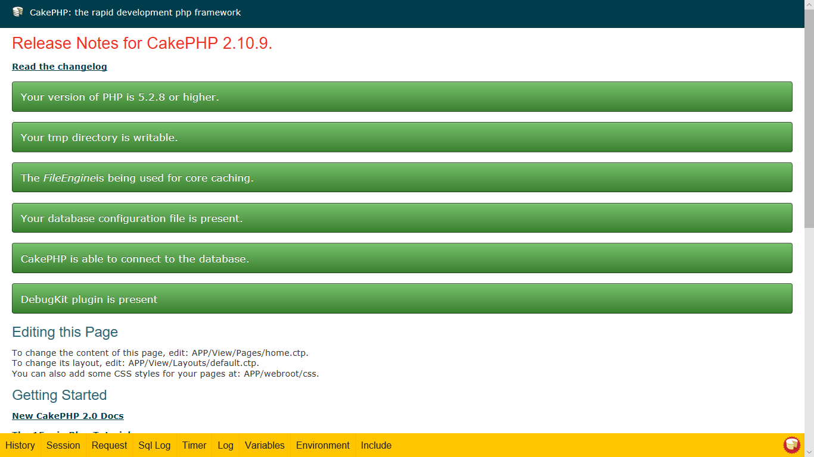

[](LICENSE.txt)

# PrettyDebug Plugin for CakePHP 2.x



## Requirements

* CakePHP 2.x
* CakePHP DebugKit plugin

## Installation

See the
[How to Install Plugins](http://book.cakephp.org/2.0/en/plugins/how-to-install-plugins.html)
in the CakePHP documentation for general help.

* Put the `PrettyDebug` directory into your plugin directory or
  install the plugin with [Composer](https://getcomposer.org/) from the directory
  where your **composer.json** file is located:

```sh
php composer.phar require chinpei215/cakephp-pretty-debug
```

* Load the plugin in your **app/Config/bootstrap.php** file:

```php
CakePlugin::load('PrettyDebug');
```

* And enable the [component](https://book.cakephp.org/2.0/en/controllers/components.html)
  in your controllers or in your **app/Controller/AppController.php**:

```php
class AppController extends Controller {
    public $components = array(
        'DebugKit.Toolbar',
        'PrettyDebug.PrettyDebug',
    );
}
```
